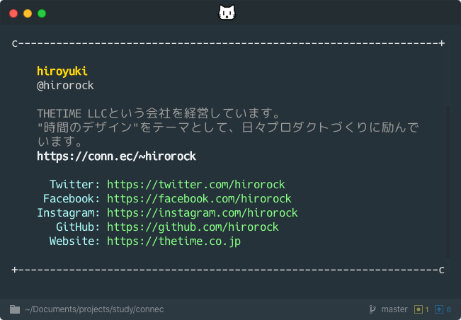

# connec [](https://travis-ci.org/THETIMEINC/connec)

This is an idea, not an ads.

> The [connec](https://conn.ec/) CLI



## Usage

Install Node.js, then:

```shell
$ npx connec <@yourname>
```

Get the information by specifying the [connec](https://conn.ec/?ref=github) "@yourname".

### Example

https://conn.ec/@hirorock

```shell
$ npx connec @hirorock
```

You can also use github repo.

```shell
$ npx github:thetimeinc/connec @hirorock
```

## Installation

This is not something to install and use.

## Inspired

- [sindresorhus/sindresorhus](https://github.com/sindresorhus/sindresorhus)
- [bnb/bitandbang](https://github.com/bnb/bitandbang)

## Privacy

I use Google Analytics.
It is for improving services, not for identifying individuals.

please check this page when using.

https://conn.ec/articles/privacy

## License

MIT © [THETIME LLC](https://thetime.com/?ref=thetimeinc/connec)
