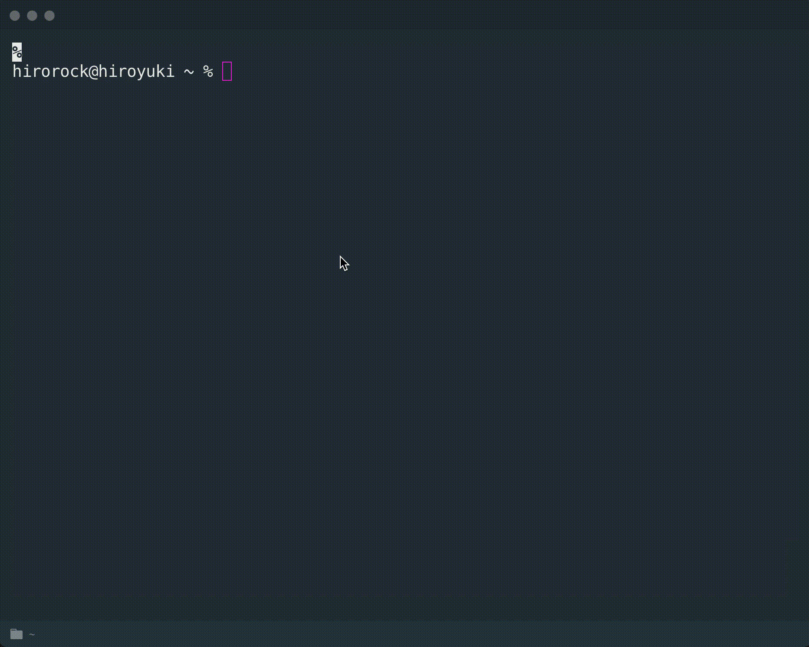

# connec [](https://travis-ci.org/THETIMEINC/connec)

This is an idea, not an ads.

> The [connec](https://conn.ec/) CLI



## Usage

1. Get a **connec** Account 👉 https://conn.ec/
2. Install Node.js, then:

   ```shell
   $ npx connec <@username>
   ```

   ```
   // e.g. https://conn.ec/@hirorock
   $ npx connec @hirorock
   ```

## Inspired

- [bnb/bitandbang](https://github.com/bnb/bitandbang)

## Privacy

I use Google Analytics.
It is for improving services, not for identifying individuals.

please check this page when using.

https://conn.ec/articles/privacy

## License

MIT © [THETIME LLC](https://thetime.com/?ref=thetimeinc/connec)
